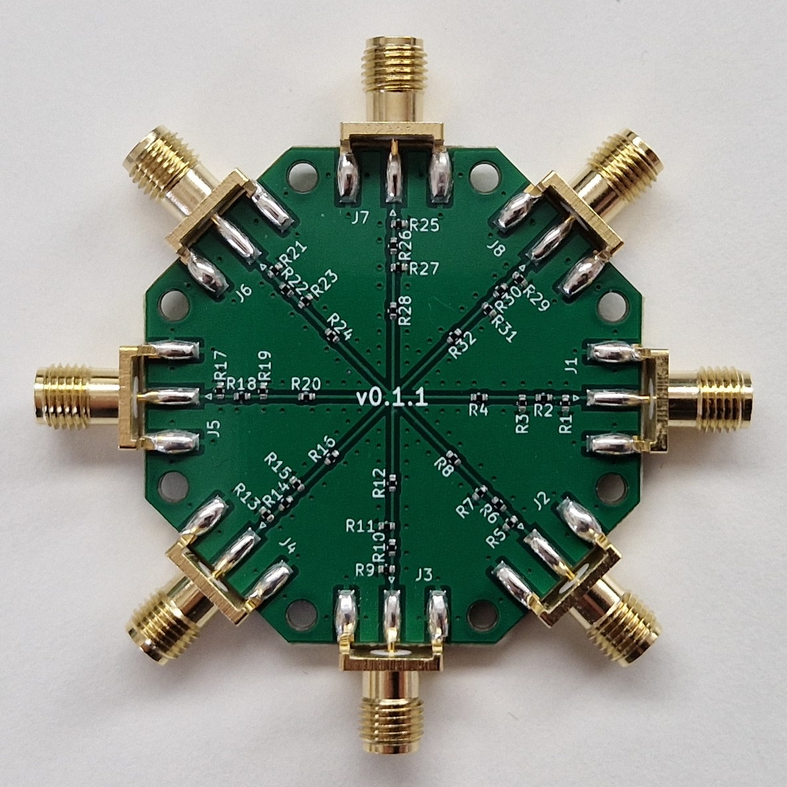
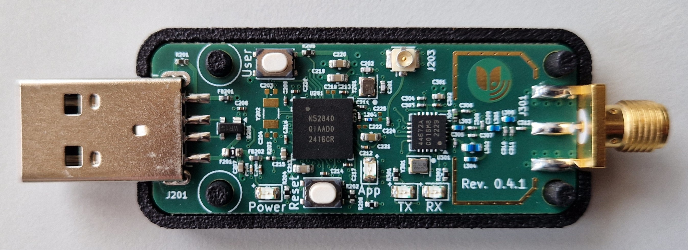
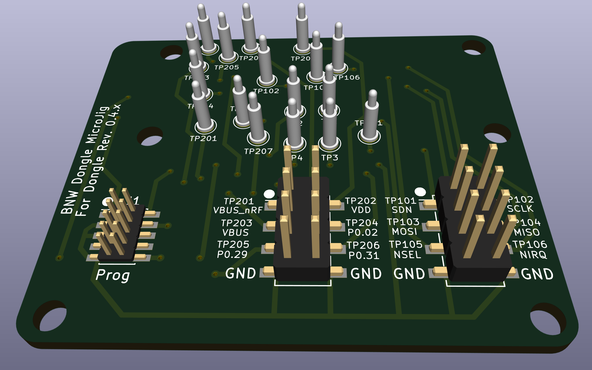
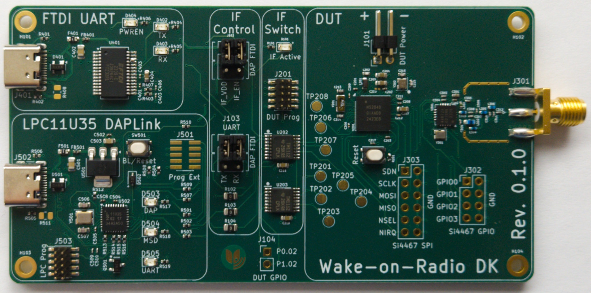

# Overview

This repository contains schematics and PCB layouts for hardware
related to BNW testing, respectively the BNW test jig.

# Devices

## Power Splitter

The directory `power_splitter/` contains a symmetrical resistive
11-way (12-port) Wye power splitter.

From theoretical perspective, it has the following specification (with
`N = 11` for `N + 1 = 12` connections).

- input impedance: `Z₀ = 50 Ω`
- power transmission: `1/N² ≅ 0.0083`
- isolation / loss: `10 * log₁₀(1/N²) ≅ 20.8 dB`
- required resistor value: `R = Z₀ * (N-1) / (N+1) ≅ 41.67 Ω`

## Power Splitter with Attenuator

The directory `power_splitter_attenuator/` contains a symmetrical
resistive 7-way (8-port) Wye power splitter with built-in attenuation
for each port.

Parameters (calculated values):
- 16.9 dB attenuation for power splitter
- 19.5 dB attenuation for π-pads
- expected S21 at 865 MHz: 16.9 dB + 2x 19.5 dB = 55.9 d

## Lemonbeat Dongle

The directory `lemonbeat_dongle/` contains a BNW version of the
Lemonbeat dongle.

See [design goals](lemonbeat_dongle/doc/design_goals.md) for a brief
description of the goals and intended features.

## Lemonbeat Dongle MicroJig

The directory `lemonbeat_dongle_microjig/` contains a minimal jig for
testing & programming the Lemonbeat dongle.

## WoR DK

The directory `wor_dk/` contains a minimal BNW Wake-On-Radio
Development Kit with support for electrically disconnecting SWD & UART
to support accurate power measurement.

# License

Unless otherwise noted, this project may be used under the CERN Open
Hardware Licence Version 2 - Strongly Reciprocal (CERN-OHL-S-2.0)
license.
