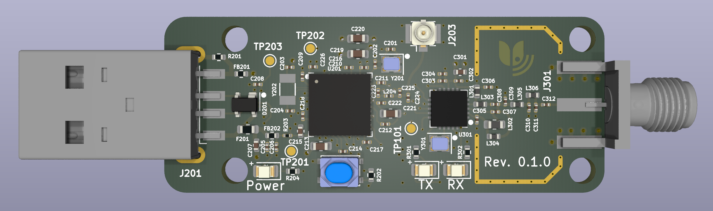

# Overview

This repository contains schematics and PCB layouts for hardware
related to BNW testing, respectively the BNW test jig.

# Devices

## Power Splitter

The directory `power_splitter/` contains a symmetrical resistive
11-way Wye power splitter.

From theoretical perspective, it has the following specification (with
`N = 10` for `N + 1 = 11` connections).

- input impedance: `Z₀ = 50 Ω`
- power transmission: `1/N² = 0.01`
- isolation / loss: `10 * log₁₀(1 - 1/N²) = 20 dB`
- required resistor value: `R = Z₀ * (N-1) / (N+1) ≅ 40.91 Ω`

## Lemonbeat Dongle

The directory `lemonbeat_dongle/` contains a BNW version of the
Lemonbeat dongle.

See [design goals](lemonbeat_dongle/doc/design_goals.md) for a brief
description of the goals and intended features.

# Further Info

Further information is available in
[Confluence](https://confluence-husqvarna.riada.se/pages/viewpage.action?pageId=106879006).
